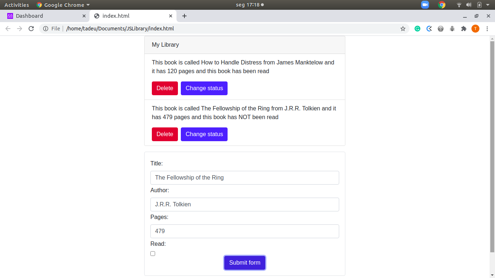

# Book Library

#### Welcome to our Book Library project. The purpose here is to create a list of books.

#### Features
- Display the form to add new books;
- Add new books to the library;
- Delete the books in the library;
- Switch the books' status between READ and UNREAD.

#### Screenshot

#### Livedemo
- [Githack](https://rawcdn.githack.com/tadeuasarro/JSLibrary/38f699d025256f9a975bd4b614b7175f4b4b00bf/index.html)

## Getting started
- run `git clone https://github.com/tadeuasarro/JSLibrary.git`;
- open `index.html` with you favorite browser.

## Authors
👤 This is us:

- [Jessica Farias](http://jessicafarias.me)
- [Tadeu A Sarro](https://tadeuasarro.web.app)

## Contributing

Contributions, issues and feature requests are welcome!

Feel free to check the [issues page](https://github.com/tadeuasarro/JSLibrary/issues)

## Show your support

Give a star if you like this project!

## 📝 License

This project is MIT licensed.
